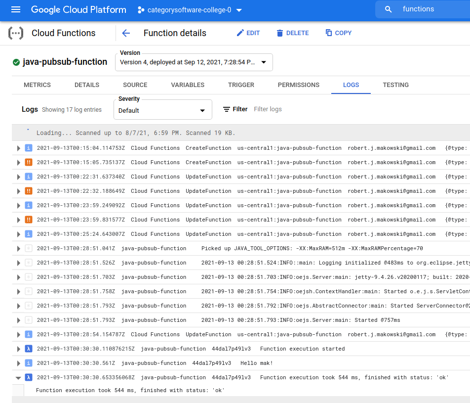

Here's some screen shots taken during process of getting this poc to work

* here's to enable GCP Functions 

* here's to deploy the GCP Function for this poc

* here's to inspecting the GCP execution logs and execution time for the GCP Function 
  

* using the GCP web UI to inspecting the GCP Function deployment
  

* using the GCP web UI to inspecting the GCP Function execution logs and execution time for the GCP Function
  

* showing the function read the message off the topic, but did so without needing a subscription
  

